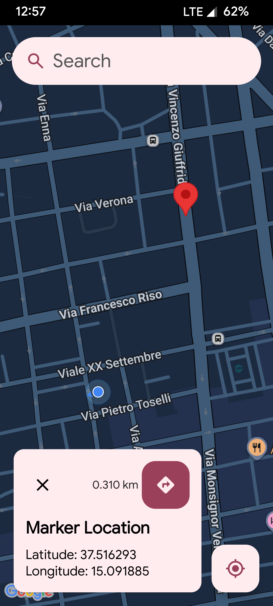
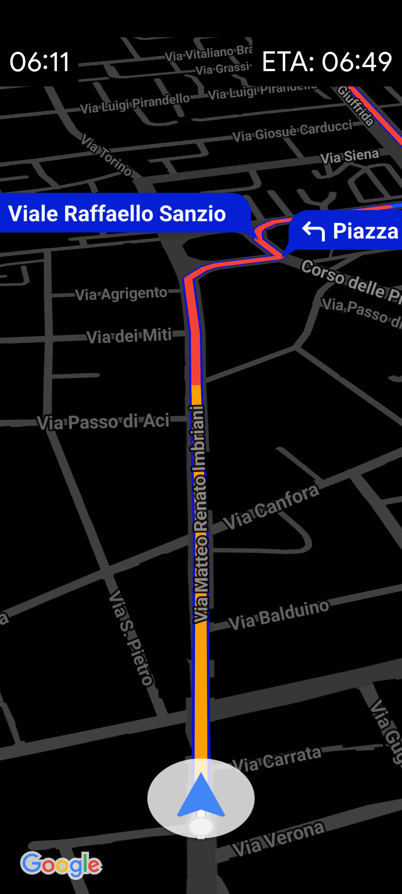
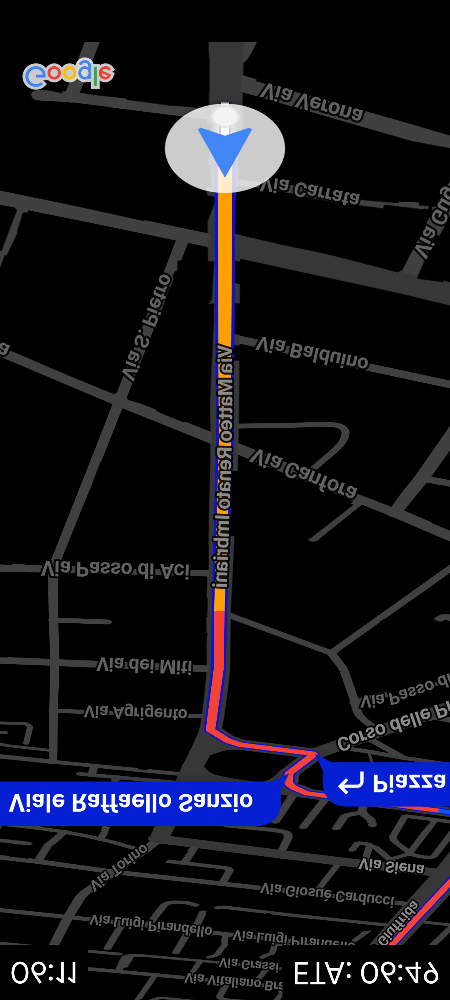

#  NavHud

A minimalist car navigation app designed specifically for **night-time driving** by projecting a **mirrored navigation interface** onto the windshield.

## What is it?

**NavHud** is a simple Android application built for drivers who want a distraction-free navigation experience at night. It works by:

- Displaying a clean, minimal map interface for route guidance.
- Mirroring the screen when tapped, so it reflects correctly onto your car's windshield — creating a HUD (Head-Up Display), by putting the phone in a stable place, on the car's dashboard.
- Allowing you to choose destinations either by:
  - Long-pressing anywhere on the map
  - Using the search bar, that uses Google Places API.

## Usage
| Main Screen | Navigation Screen | Mirrored Navigation |
|:---:|:---:|:---:|
| The first screen is a map with a top search bar to search for destination places, or long tapping anywhere on the map to set a marker to navigate to | The navigation screen is a minimal map with the route to follow, no directions nor other distractions | You can flip the whole navigation screen by tapping anywhere, so you can mirror it to the windshield for easy readability at night |
|  |  | 


## 🧰 Features

- 🔎 Google Places API integration for search
- 📍 Minimal Google Maps interface for clean driving experience
- 🧭 Route display with Google Navigation API
- 🔄 One-tap mirroring for HUD-style windshield projection
- 🌙 Best for night use (daytime you can just use your go-to navigation app, since you can't mirror it anyways because of day light)

## 🛠️ Requirements

This app relies on several Google APIs:

- Google Maps SDK
- Google Navigation API
- Google Places API

### To use the app, you must:

1. Have a **Google Maps API key**
2. Set the key as an environment variable:

   ```bash
   export MAPS_API_KEY=your_google_maps_key
3. Build the application using:
    ./gradlew assembleRelease
4. The resulting APK will be found in:
    app/build/outputs/apk/release/

⚠️ Note: The API key is not included in this repository. You must create your own via Google Cloud Console

## License

Copyright (C) 2025 simone-05

This program is free software: you can redistribute it and/or modify it under the terms of the GNU Affero General Public License as published by the Free Software Foundation, version 3.

This program is distributed in the hope that it will be useful, but WITHOUT ANY WARRANTY; without even the implied warranty of MERCHANTABILITY or FITNESS FOR A PARTICULAR PURPOSE. See the GNU Affero General Public License for more details.

You should have received a copy of the GNU Affero General Public License along with this program. If not, see <https://www.gnu.org/licenses/>.

Full license: [AGPL-3.0](LICENSE)
